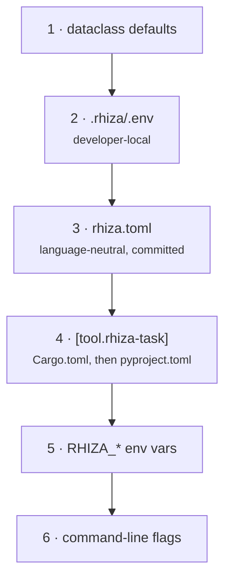

# Configuration

The make layer built its settings from three overlapping mechanisms: `?=` defaults in the
fragment that owned a setting, `+=` accumulation from other fragments, and a repo-owned
`Makefile` or `local.mk` assigning over the top. The precedence was a *consequence of
include order* — which is why `rhiza.mk` had to explain that `-include .rhiza/make.d/*.mk`
comes last and `-include local.mk` last of all.

Here the order is explicit and testable.

## Six layers

Lowest precedence first — each layer overrides the ones above it:



| # | layer | notes |
|---|---|---|
| 1 | dataclass defaults | the table [below](#settings) |
| 2 | `.rhiza/.env` | kept unchanged, because it is already the file consumers edit and the reusable workflows read it too |
| 3 | `rhiza.toml` | the language-neutral file — the only committed settings surface a Go module can have |
| 4 | `[tool.rhiza-task]` in the manifest | `Cargo.toml`, then `pyproject.toml` |
| 5 | `RHIZA_*`, or bare make-style variables | `RHIZA_COVERAGE_FAIL_UNDER=95` or `COVERAGE_FAIL_UNDER=95` |
| 6 | command-line flags | `--strict`, `--root` |

!!! note "`.rhiza/.env` is now developer-local"
    rhiza no longer ships `.rhiza/.gitignore`, whose entire content was the `!.env`
    negation that kept the file tracked. It therefore falls under the shipped
    `.gitignore`'s `.env` rule, and **a CI checkout never contains it**. Anything CI needs
    belongs in layer 3 or 4.

### Why two files, not one

Neither layer 3 nor layer 4 alone covers the three language layers: `pyproject.toml` is
Python-only, and a repository that already moved its settings there should not have to
move them again.

`rhiza.toml` ranks *below* the manifest deliberately, so that adding it to a Python
repository cannot silently outrank the table already there.

=== "pyproject.toml"

    ```toml
    [tool.rhiza-task]
    source_folder = "src"
    typechecker = "ty"
    coverage_fail_under = 95
    license_ignore_packages = ["docutils"]
    ```

=== "rhiza.toml"

    ```toml
    # A Go module or a Rust crate, or any repo that would rather not thread
    # settings through a manifest.
    source_folder = "cmd"
    coverage_fail_under = 95
    ```

=== "Cargo.toml"

    ```toml
    # Cargo ignores unknown top-level tables, so this is as harmless here as
    # it is in pyproject.
    [tool.rhiza-task]
    source_folder = "src"
    coverage_fail_under = 95
    ```

In `rhiza.toml`, settings sit at the top level; a `[tool.rhiza-task]` table is honoured too
and wins when both are present.

## Reading a resolved value

`print` replaces make's `print-%` pattern rule, and collapses all six layers to the one
value a task will actually see:

```bash
uvx rhiza-task@1.4.0 print coverage_fail_under
uvx rhiza-task@1.4.0 print COVERAGE_FAIL_UNDER   # either spelling
```

Field names are the lowercased make variables, so the mapping to what a consumer already
knows stays one-to-one and greppable. `print` exits 2 when the setting does not exist.

## An empty value is unset

In the two string-valued layers, an empty value **leaves the layer below it alone** rather
than resolving to `""`:

```bash
RHIZA_CI_OS_MATRIX= uvx rhiza-task@1.4.0 ci-os-matrix   # still the default
```

That is make's `$(or ...)` rule, and the reusable workflows depend on it: `rhiza_ci.yml`
exports one for every caller and deliberately leaves it empty for consumers, whose own
`.rhiza/.env` is meant to answer.

## Settings

### Layout and versions

| setting | default | what |
|---|---|---|
| `source_folder` | `src` | the package tree the gates measure |
| `tests_folder` | `tests` | the test tree |
| `docs_folder` | `docs` | the prose docs tree, whose examples `docs-examples` checks |
| `marimo_folder` | `docs/notebooks` | Marimo notebooks, exported into the book |
| `book_output` | `_book` | where `book` writes the built site |
| `python_version` | `3.13` | the interpreter tasks provision |

### Gates and thresholds

| setting | default | what |
|---|---|---|
| `coverage_fail_under` | `90` | the coverage floor, enforced wherever `test` runs |
| `complexity_max` | `15` | the cyclomatic-complexity ceiling `complexity` enforces |
| `typechecker` | `ty` | `ty`, `mypy` or `both` |
| `license_fail_on` | `("GPL", "LGPL", "AGPL")` | matched as **substrings** |
| `license_ignore_packages` | `()` | packages exempt from the copyleft scan |
| `deptry_ignore` | `()` | deptry rule codes to suppress |

!!! warning "`typechecker = "both"` masks `ty`"
    `python.mk` documented it and the behaviour is unchanged: `both` hides `ty`'s exit
    status behind mypy's. A typo like `typechecker = "tpye"` now fails *before* any tool
    is provisioned, rather than after — the shell `case` that used to validate this is a
    `__post_init__` check.

### Rust and Go

| setting | default | what |
|---|---|---|
| `cargo_flags` | `()` | extra flags for every cargo invocation |
| `go_flags` | `()` | extra flags for every go invocation |
| `go_test_flags` | `("-race", "-shuffle=on")` | the Go idiom for a CI run — `-shuffle=on` catches tests that depend on declaration order |

### Book, paper and slides

| setting | default | what |
|---|---|---|
| `mkdocs_extra_packages` | `("mkdocstrings[python]",)` | provisioned into the zensical build |
| `zensical_version` | `>=0.0.36` | the book builder |
| `paper_folder` | `docs/paper` | the LaTeX root |
| `presentation_file` | `PRESENTATION.md` | the Marp source |
| `marp_package` | `@marp-team/marp-cli` | unpinned, as `npm install -g` was; set `@marp-team/marp-cli@4.2.3` to pin |

!!! info "Why `mkdocs_extra_packages` defaults to something"
    rhiza's `book` bundle ships `docs/mkdocs-base.yml` with `mkdocstrings` enabled
    unconditionally, and every consumer inherits it via `INHERIT`. With this empty, `book`
    invoked `uvx zensical build` with no `--with`, and zensical refused:

    ```text
    Error: mkdocstrings plugin is enabled, but mkdocstrings is not installed.
    ```

    So the bundle shipped a config that could not build with its own default. A repository
    that wants no plugins sets `mkdocs-extra-packages = []` in its manifest — TOML only,
    deliberately.

### Docker

| setting | default | what |
|---|---|---|
| `docker_folder` | `docker` | the build context |
| `docker_image` | *(empty)* | resolved in the task body when unset |

`docker.mk`'s `DOCKER_FOLDER` was a `:=` rather than a `?=` — not configurable at all.
Both are ordinary settings now, because there is no longer a cost to making one.
`docker_image` is empty rather than a computed default because `?= $(shell basename
$(CURDIR))` cannot be spelled as a dataclass default, and keeping it empty keeps
`rhiza-task print docker_image` honest about the setting being unset.

### Environment and CI

| setting | default | what |
|---|---|---|
| `uv_sync_args` | `("--all-extras", "--all-groups")` | what `install` passes to `uv sync` |
| `ci_os_matrix` | `("ubuntu-latest",)` | feeds `ci-os-matrix` |
| `pytest_rhiza` | pinned to a tag | the `rhiza-test` provider — a gate that moves under you is not a gate |

**Empty means "omit `--with` entirely."** The pin is right for a consumer, and wrong for the
one case that wants the opposite: trying an unreleased check against a real subject, which
otherwise means publishing something first. Set it empty and `rhiza-test` and
`test-pyproject` pass no `--with` at all, so `uv run` answers from the project environment —
where an editable path source, say, actually tracks the working tree:

```toml
[tool.rhiza-task]
pytest-rhiza = ""
```

TOML only, for the same reason as `mkdocs-extra-packages = []` above: `RHIZA_PYTEST_RHIZA=`
reads as unset, and only TOML tells an empty string from an absent key.

`pytest-rhiza = "."` looks like the shorthand and is a trap. `uv run --with .` resolves to a
**cached built copy** that is not rebuilt on edit, so a broken check goes uncaught while the
gate looks like it ran against your tree — worse than the pin, which at least declares what
it is.

### Detected, not configured

| setting | default | what |
|---|---|---|
| `layers` | *(detected)* | from the manifests present |
| `rhiza_checks` | *(derived)* | follows from `layers` |
| `strict` | `false` | turns `Skip` into failure |
| `root` | *(cwd)* | the repository to operate on |

Both `layers` and `rhiza_checks` are empty by default and filled in afterwards, because
both depend on the repository rather than on a constant. **Setting either explicitly
switches detection off for that field** — which is exactly what a repository carrying two
manifests but wanting one gate set needs:

```toml
[tool.rhiza-task]
layers = ["rust"]
```

```bash
RHIZA_LAYERS=rust uvx rhiza-task@1.4.0 test
```

## No `+=` successor, and none needed

The three accumulators — `DEPTRY_FOLDERS`, `LICENSE_IGNORE_PACKAGES`, `RHIZA_CHECKS` —
have no replacement mechanism. Each was a bundle contributing something it owned, which a
task body now *derives* by asking whether the contributing task is registered. See `deps`
and `license` in `tasks/python.py`.

## This repository's own settings

`rhiza-task` configures itself with the mechanism it sells — layer 4:

```toml
[tool.rhiza-task]
coverage_fail_under = 95
```

The floor is raised from the shipped default of 90 because 90 is the *tool's* answer for a
repository it knows nothing about. This one can do better, so 95 is a floor that is met
with headroom and still says something.
