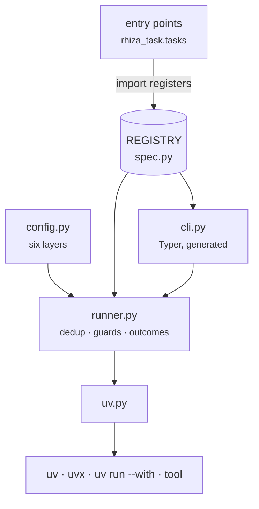

# Design

## The observation the package rests on

Reading all ten make fragments back to back, **every recipe has the same three parts**:

1. a **guard** on a folder (or a binary) existing,
2. a **provision** via `uv run --with` or `uvx`,
3. a long, mostly **static argument list**.

So the model is declarative. A task is data — a name, a section, prerequisites, guards —
plus a short body that assembles an argument vector.

## The four that genuinely are not declarative

The escape hatch exists because exactly four recipes resisted the form, and it is worth
naming them so the exception stays bounded:

| task | why |
|---|---|
| `test` | retry once on pytest exit **3** — the xdist teardown race — and never on 1, 2 or 4 |
| `mutation` | run, render HTML, move the output, report the **first** status |
| `doctor` | semantic version comparison, formerly an `awk` function inside a make recipe |
| `book` | aggregate gates, copy reports, export notebooks, build, badge |

## Modules

| module | what |
|---|---|
| `spec.py` | `Task`, `Guard`, `Skip`/`Failed`, the `@task` registry, layer resolution |
| `config.py` | six-layer resolution, replacing `?=` and `+=` |
| `uv.py` | the three ways rhiza reaches a tool |
| `runner.py` | prerequisite dedup, guards, outcome bookkeeping |
| `cli.py` | Typer app, generated from the registry |
| `tasks/*.py` | the gates themselves, loaded by entry point |



## How a tool gets reached

Every recipe in the retired Python make layer used one of exactly three forms, and that
distinction is preserved rather than unified, because the make layer already got it right:

| form | when | examples |
|---|---|---|
| `uv <subcommand>` | uv itself | `venv`, `sync`, `lock --check` |
| `uvx <tool>` | an isolated one-shot tool run | prek, deptry, bandit, semgrep, zensical, genbadge |
| `uv run --with a --with b <tool>` | a tool run **against the project environment**, because it imports the project's own code | pytest, interrogate, mutmut, `ty`, mypy |

Rust and Go add a fourth, and only a fourth: a toolchain binary already on `PATH`, because
uv provisions neither `cargo` nor `go` and nothing here pretends otherwise. It shares the
module's environment handling and echoing rather than being a bare `subprocess.call` in
each language module — so `$ cargo clippy` is printed the same way `$ uvx bandit` is.

!!! note "No shell, anywhere"
    Commands are argument vectors, never shell strings. `rhiza.mk` carried a 40-line probe
    to detect make falling back to `cmd.exe` on Windows, because its recipes were POSIX
    shell. With no shell there is nothing to detect — and CI keeps `windows-latest` in the
    matrix precisely to assert that the dependency is really gone.

## Three things fall out for free

### Double-colon rules disappear

`book` depends on gates the `tests` bundle may never have contributed. In make that
required four no-op stubs (`test:: ; @:`) so the dependency could exist at all. Here the
runner skips unregistered prerequisites, so the question is just `"test" in REGISTRY`.

### Skip is a first-class outcome

Not a soft failure, not a pass — a third status. Which means `--strict` can promote every
skip to a failure, and a consumer's CI can assert that a gate actually measured something.

### Help stops being a parser

`rhiza.mk` built its help by running `awk` over `$(MAKEFILE_LIST)` looking for `##` and
`##@` comments — a parser for a documentation convention that existed only because make
has no notion of a task description.

Typer has one. Help text, sections, per-task help and the "unknown task" error all come
from the same registry the runner uses, so **the two cannot drift**.

## The bare-name shorthand is a contract

`rhiza-task test` rewrites to `rhiza-task run test`. That is not sugar: the reusable
workflows and a repo-owned forwarding `Makefile` both invoke `rhiza-task test`, and a
consumer's muscle memory is `make test`. Requiring the extra word would put a word between
the two for no gain.

A consequence worth knowing: `rhiza-task --help` lists only the five real subcommands, and
`list` is how you enumerate tasks.

## Exit status is propagated, not collapsed

`run` exits with the **first failing task's own status** — pytest's 2 or 4, `cargo`'s 101 —
falling back to 1 when the tool has none. A usage error is also 2, so a usage error and a
task that exited 2 share a status; the printed run summary distinguishes them.

The alternative is discarding the code, which is the one thing every consumer's CI
actually wants.

## A plugin cannot take the gates down

`load_tasks()` imports every module in the `rhiza_task.tasks` entry-point group, and a
failure is **reported and skipped** rather than fatal:

```
could not load task module acme: ModuleNotFoundError: No module named 'acme_internal'
```

A broken third-party task module should not stop `test` from running.

## How it is tested

**No test in the suite runs uv.** Every task test patches the entry points in `uv.py` and
asserts on the *argument vector that would have been executed*.

That is exactly what the make recipes expressed in `$$`-escaped shell and could not
assert — and it is why the suite is fast enough to be the inner loop.

## Further reading

- [Adding a Task](adding_a_task.md) — the entry-point mechanism, from the outside
- [Configuration](configuration.md) — the six layers in detail
- [API Reference](api.md) — the modules above, with signatures
