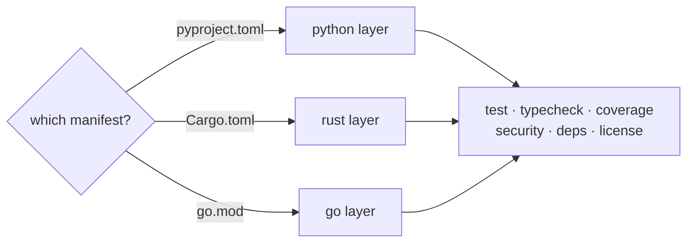

# rhiza-task

**The rhiza developer tasks, as a pinned CLI** — not a synced make layer.

[](https://pypi.org/project/rhiza-task/)
[](https://pypi.org/project/rhiza-task/)
[](https://github.com/Jebel-Quant/rhiza-task/actions/workflows/ci.yml)
[](https://github.com/Jebel-Quant/rhiza-task/blob/main/LICENSE)
[](https://github.com/astral-sh/uv)
[](https://github.com/astral-sh/ruff)

---

**Quick links:** [📦 PyPI](https://pypi.org/project/rhiza-task/) • [📚 Repository](https://github.com/jebel-quant/rhiza-task) • [🐛 Issues](https://github.com/jebel-quant/rhiza-task/issues) • [🌱 rhiza](https://github.com/jebel-quant/rhiza) • [🧪 pytest-rhiza](https://github.com/jebel-quant/pytest-rhiza)

---

## 📋 Overview

```bash
uvx rhiza-task@1.2.0 test
```

There is nothing to install and nothing to sync. One command runs a project's gates, and
which gates those are is decided by the manifest in the repository — `pyproject.toml`,
`Cargo.toml` or `go.mod`.

`rhiza-task` is the sibling of [`pytest-rhiza`](https://github.com/jebel-quant/pytest-rhiza),
which did the same thing for `.rhiza/tests`.

## 🎯 The problem it deletes

The pain was never make's syntax — it was **distribution by copying**, which make
structurally cannot fix, because `include` cannot reach a remote file. Every consumer got a
full copy of the task layer at a template tag, and everything downstream was damage
control.

Version pinning becomes a *dependency* pin, which is a real mechanism instead of "copy
files at tag v1.3.3 and hope nobody edited them."

| before, per consumer repo | after |
|---|---|
| `.rhiza/rhiza.mk` — 200 lines, synced | *gone* |
| `.rhiza/make.d/*.mk` — 1023 lines in 15 files, synced | *gone* |
| `exclude:` entries in `template.yml`, because a deletion alone is undone by the next sync | not needed |
| targets shadowed in the repo `Makefile` | `[tool.rhiza-task]` |
| ~40 lines of GNU-make guard and Windows POSIX-shell probe | gone — no make, no shell |
| `install-uv` — 30 lines of `bootstrap.mk` shell | gone — `uvx` provisions the runtime |
| `Makefile` | repo-owned, if a repo wants one |

## 🚀 Three commands

<div class="grid cards" markdown>

-   :material-format-list-bulleted:{ .lg .middle } **See what is available**

    ---

    Tasks, grouped by section, with prerequisites and a one-line description.

    ```bash
    uvx rhiza-task@1.2.0 list
    ```

    [→ The task catalogue](tasks.md)

-   :material-check-all:{ .lg .middle } **Run every gate**

    ---

    The aggregate CI runs: format, deps, test, docs, security, licence, types.

    ```bash
    uvx rhiza-task@1.2.0 all
    ```

    [→ Getting started](getting_started.md)

-   :material-tune:{ .lg .middle } **Read a resolved setting**

    ---

    Six configuration layers, collapsed to the one value a task will actually see.

    ```bash
    uvx rhiza-task@1.2.0 print coverage_fail_under
    ```

    [→ Configuration](configuration.md)

</div>

## 🧩 One set of names, three languages

`test` is pytest in a Python project, `cargo nextest` in a crate and `go test` in a
module. That gate-parity contract is what lets a reusable workflow call `typecheck`
without knowing the language.



The make layer answered "which one?" at *sync* time, by copying exactly one of
`python.mk`, `rust.mk` and `go.mk` into a repository. A pinned CLI carries all three, so
the answer is the manifest that is present — and the layers you do *not* have stay
addressable as `rhiza-task rust:test`.

[→ How the layers resolve](layers.md)

## 📐 Why it is small

Reading all ten make fragments back to back, **every recipe has the same three parts**: a
guard on a folder existing, a provision via `uv run --with` or `uvx`, and a long, mostly
static argument list. So the model is declarative, with an escape hatch for the three
recipes that genuinely are not.

[→ The design](design.md) · [→ Adding your own task](adding_a_task.md)

## 📖 Where to go next

| If you want to… | Read |
|---|---|
| run this against your project for the first time | [Getting Started](getting_started.md) |
| know what every task does, and when it skips | [Tasks](tasks.md) |
| change a threshold, a folder or a typechecker | [Configuration](configuration.md) |
| understand polyglot repositories and `rust:test` | [Language Layers](layers.md) |
| add a project-specific gate | [Adding a Task](adding_a_task.md) |
| retire a synced make layer | [Migrating from make](migration.md) |
| know why it is not a Taskfile | [FAQ](faq.md) |
