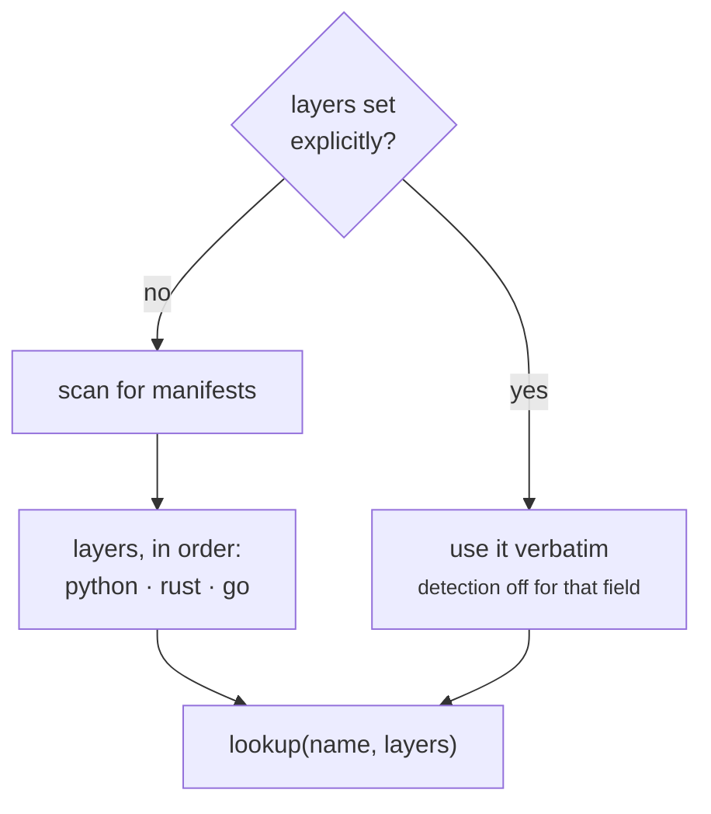

# Language Layers

`test` is pytest in a Python project, `cargo nextest` in a crate and `go test` in a
module. That is the **gate-parity contract**, and it is what lets a reusable workflow call
`typecheck` without knowing the language.

## How the answer is chosen

The make layer answered "which language?" at **sync** time, by copying exactly one of
`python.mk`, `rust.mk` and `go.mk` into a repository. A pinned CLI carries all three, so
the answer has to come from the repository itself — and it does, from the **manifest
present**:

| manifest | layer |
|---|---|
| `pyproject.toml` | `python` |
| `Cargo.toml` | `rust` |
| `go.mod` | `go` |



A repository with two manifests gets **both** layers, in that order. Python comes first
because it is the layer a polyglot repository is most likely to have grown *into*: a crate
or a module that acquires a `pyproject.toml` has acquired a Python package, and the gates
that package needs are the ones that would otherwise stop running.

## Shadowing, and reaching the layer that lost

A layered task shadows a neutral one of the same name, and the layers are tried in order —
so a crate with a Python binding package gets a single answer rather than an ambiguity:

```python
from rhiza_task.spec import lookup
from rhiza_task.tasks import python, rust  # importing is what registers

print(lookup("test", ["python", "rust"]).key)
print(lookup("test", ["rust", "python"]).key)
```

```result
python:test
rust:test
```

Those two lines are **executed and diffed**, not annotated: the answers used to sit in
trailing `# 'python:test'` comments, which is the shape that goes stale silently -- a change
to layer precedence would have left them rendering perfectly and wrong. `rhiza-task
docs-examples` now runs the fence and compares.

`layer:name` addresses one layer explicitly, and is the **only** way to reach the layer
that did not win:

```bash
uvx rhiza-task@1.6.0 rust:test
```

Pinning the layer list does the same thing globally:

```toml
[tool.rhiza-task]
layers = ["rust"]
```

Setting `layers` explicitly switches detection off for that field — which is exactly what
a repository carrying two manifests but wanting one gate set needs.

## Seeing the other layers

`list` shows this repository's layers plus the language-neutral tasks — a Go module is not
helped by being shown `benchmark` and `marimo-validate`, and that is also what the make
layer showed, having synced exactly one fragment.

`--all` answers the question the make layer could not:

```bash
uvx rhiza-task@1.6.0 list --all   # what the layers you do not have call things
```

## A missing name is `None`, not an error

A neutral task answers to its bare name whatever the layers are, and **a name no active
layer has resolves to nothing rather than raising**. That is what lets `book` depend on
gates a repository may not have:

```python
needs = ("test", "benchmark", "stress", "hypothesis-test", "paper")
```

In make this required `book.mk` to declare four no-op double-colon stubs —
`test:: ; @:` and friends — so that the dependency could exist at all. The runner skips
unregistered prerequisites, so all four are gone. `paper` is the fifth name and never had
a stub: it is neutral rather than layered, so it resolves in every repository, and what it
does about a repository with no `.tex` file is skip.

## What every layer must deliver

Three contracts hold across all three layers, and they are the reason a
language-independent workflow works at all.

### `coverage` writes `_tests/coverage.xml`

At that exact path, in every layer, because it is what `book`'s badge step reads and what
CI uploads:

| layer | how |
|---|---|
| Python | pytest's `--cov` report flags |
| Rust | `cargo llvm-cov --cobertura` |
| Go | a coverage profile piped through `gocover-cobertura`, plus the floor check `go test` has no flag for |

### `rhiza_checks` derives from the layers

Not configured — derived. The neutral checks, plus:

| layer | adds |
|---|---|
| python | `test_pyproject`, `test_docstrings` |
| rust | `test_cargo_toml` |
| go | `test_go_module` |

Setting `rhiza_checks` explicitly switches that derivation off, exactly as with `layers`.

### `install-uv` is not a task, and cannot be one

It would have to provision the runtime that every task already runs under. A CI runner
that ships no uv adds an `astral-sh/setup-uv` step instead — a workflow can simply say so,
where `bootstrap.mk` needed 30 lines of shell to curl the installer into `./bin` because
make could not assume uv existed.

## The cost, stated plainly

`rust.mk` and `go.mk` needed only make. The Rust and Go layers here are **Python calling
`cargo` and `go`**, so a crate now needs uv to run its gates.

That is the trade the whole package makes, and the Rust and Go layers are where it costs
the most. It buys the pin, and the deletion of 1200 synced lines per consumer; it costs a
Python runtime in a repository that may have had no other reason for one.
