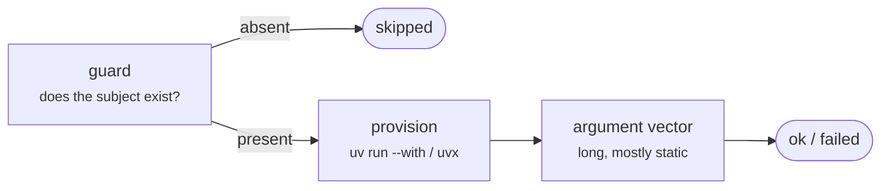

# Tasks

Every task is `rhiza-task <name>`. The catalogue below is the registry the CLI generates
its own help from — `rhiza-task list` is the authoritative version for *your* repository,
and `rhiza-task list --all` adds the layers you do not have.

## The shape every task shares

Reading all ten make fragments back to back, every recipe turned out to have the same
three parts:



That is why a **guard** and a **skip** appear all over this page: they are the model, not
special cases.

## Python

| task | needs | does |
|---|---|---|
| `install` | — | create the venv and sync dependencies |
| `test` | `install` | run all tests |
| `coverage` | `install` | measure coverage and write `_tests/coverage.xml` |
| `typecheck` | `install` | run `ty` and/or `mypy` (`typechecker = ty \| mypy \| both`) |
| `security` | `install` | run the bandit security scan |
| `deps` | `install` | run deptry over the contributed folders |
| `license` | `install` | scan for copyleft licences |
| `docs-coverage` | `install` | check docstring coverage with interrogate |
| `all` | `fmt deps test docs-coverage security license typecheck rhiza-test` | run every gate, as CI does |

`test` and `coverage` share one argument builder, so the two cannot drift: both write
`_tests/coverage.xml`, `_tests/coverage.json`, `_tests/html-coverage/` and
`_tests/html-report/report.html`. That fixed path is a contract — it is what `book`'s
badge step reads and what CI uploads.

!!! info "`test` retries once, on exit 3 only"
    Exit 3 is the xdist teardown race. A retry on 1, 2 or 4 would be re-running a real
    failure and hoping, so it never happens.

## Rust

| task | needs | does |
|---|---|---|
| `install` | — | install the toolchain and fetch dependencies |
| `cargo-tools` | — | install the cargo subcommands the gates need |
| `test` | `install cargo-tools` | run the test suite with nextest, then the doctests |
| `coverage` | `install cargo-tools` | measure coverage and write `_tests/coverage.xml` |
| `typecheck` | `install` | lint with clippy, warnings as errors |
| `security` | `install cargo-tools` | scan dependencies for known advisories |
| `deps` | `install cargo-tools` | report unused dependencies |
| `license` | `install cargo-tools` | run the licence compliance scan |
| `docs-coverage` | `install` | fail on any undocumented public item |
| `all` | `fmt test docs-coverage security deps license typecheck rhiza-test` | run every gate, as CI does |

## Go

| task | needs | does |
|---|---|---|
| `install` | — | install the toolchain and download dependencies |
| `go-tools` | — | install the Go tools the gates need |
| `test` | `install` | run the test suite |
| `coverage` | `install go-tools` | measure coverage and write `_tests/coverage.xml` |
| `typecheck` | `install go-tools` | vet and lint (the compiler already type-checks) |
| `security` | `install go-tools` | scan dependencies for known vulnerabilities |
| `deps` | `install` | report dependency drift |
| `license` | `install go-tools` | run the licence compliance scan |
| `docs-coverage` | `install go-tools` | fail on any undocumented exported item |
| `all` | `fmt test docs-coverage security deps license typecheck rhiza-test` | run every gate, as CI does |

Go has no coverage-floor flag, so `coverage` pipes a profile through `gocover-cobertura`
and checks the floor itself.

## Quality

| task | needs | does |
|---|---|---|
| `fmt` | — | run the pre-commit hooks over all files |
| `semgrep` | — | run the semgrep static analysis rules |
| `rhiza-test` | `install` | run the rhiza repository checks |
| `test-pyproject` | `install` | run the `pyproject.toml` structure checks, verbosely |
| `todos` | — | list every TODO, FIXME and HACK comment |
| `complexity` | — | fail on a block above the cyclomatic-complexity ceiling |
| `docs-examples` | `install` | check the fenced examples in the docs tree |

`fmt` skips without a `.pre-commit-config.yaml`, `semgrep` without a
`.rhiza/semgrep.yml`, and `docs-examples` without a docs folder — or with one holding no
fence it can check. None is a defect — see [Skip is an outcome](#skip-is-an-outcome).

`docs-examples` parses every `python` fence with `compile`, every `bash` fence with
`bash -n` — parsed, never executed — and runs the `python` fences that a ```result```
block follows, diffing what they print against that block. Fences in any other language
are reported as unchecked with a count, because silence there would read as full
coverage. It answers the question no other gate does: not "is there a docstring?" but
"is what the documentation claims still true?"

`complexity` is the one task in this section that is Python-only: it runs `radon`, so it is
registered in the `python` layer even though it reads like a neutral gate. It measures every
block in `source_folder` and fails when one scores above
[`complexity_max`](configuration.md#gates-and-thresholds) (default `15`).

It is deliberately **not** a prerequisite of `all`. `all` is the aggregate a consumer's CI
invokes, so adding a gate to it would fail builds in repositories that changed nothing —
name `complexity` in a workflow step to opt in, as this repository's `ci.yml` does. A repo
whose blocks are larger should raise the ceiling rather than skip the gate; 15 suits a
codebase that already argues its complex blocks in comments.

`rhiza-test` runs the checks that used to live in a synced `.rhiza/tests/` folder, now
provisioned as [`pytest-rhiza`](https://github.com/jebel-quant/pytest-rhiza). Which checks
run is derived from the language layer, not configured: the neutral ones, plus
`test_pyproject` and `test_docstrings` for Python, `test_cargo_toml` for Rust,
`test_go_module` for Go.

## Testing extras

| task | needs | does |
|---|---|---|
| `benchmark` | `install` | run the performance benchmarks |
| `hypothesis-test` | `install` | run the property-based tests |
| `stress` | `install` | run the stress and load tests |
| `mutation` | `install` | run mutation testing with mutmut |

`mutation` is one of the four genuinely procedural recipes: it runs, renders HTML, moves
the output and reports the **first** status rather than the last.

## Book

| task | needs | does |
|---|---|---|
| `book` | `test benchmark stress hypothesis-test paper` | build the companion book |
| `serve` | `book` | build the book and serve it on port 8000 |
| `marimo` | `install` | start the Marimo editor |
| `marimo-validate` | `install` | check that every Marimo notebook runs |

`book` aggregates the report-producing gates, copies `_tests/` into `docs/reports/`,
exports every Marimo notebook to `docs/notebooks/*.html`, builds the site with
[zensical](https://github.com/squidfunk/zensical), and generates a coverage badge. It
skips entirely without a `mkdocs.yml`.

`paper` is a prerequisite but needs no copy step, unlike `_tests/`: latexmk writes the PDF
beside its source, and `paper_folder` (default `docs/paper`) is already inside `docs_dir`,
so the site build picks it up as an asset and `mkdocs.yml` only names it in `nav`. A
repository with no paper — or no latexmk — still builds its book, because a *skipped*
prerequisite does not block a dependent; only a failed one does. Under `--strict` that skip
becomes a failure and would block `book`, which is worth knowing but is not specific to
`paper`: `benchmark` and `stress` guard on folders most repositories do not have.

Its prerequisite list is also where make's no-op stubs came from: `book.mk` had to declare
`test:: ; @:`, `benchmark:: ; @:`, `stress:: ; @:` and `hypothesis-test:: ; @:` so that
`book` could depend on gates the `tests` bundle may never have contributed. The runner
skips unregistered prerequisites, so all four stubs are gone.

`serve` uses Python's own HTTP server rather than an editor's built-in one, because the
JetBrains server refuses to serve gitignored directories and `_book` is one.

## Dev

| task | needs | does |
|---|---|---|
| `doctor` | — | check local prerequisites |
| `clean` | — | remove build artifacts and stale local branches |

`doctor` is the third procedural escape — it compares semantic versions, which used to be
an `awk` function inside a make recipe.

## Bundle-owned sections

The last five sections are the bundle-owned fragments. **None is a gate**: no `all` names
them and no workflow invokes them. Each is guarded on the CLI it wraps and skips when that
tool is absent, with `--strict` for a caller who wants the hard failure instead.

### GitHub Helpers

| task | does |
|---|---|
| `view-prs` | list open pull requests |
| `view-issues` | list open issues |
| `failed-workflows` | list recent failing workflow runs |
| `workflow-status` | show recent runs for the release workflow |
| `latest-release` | show information about the latest GitHub release |
| `whoami` | check github auth status |

### Docker

| task | needs | does |
|---|---|---|
| `docker-build` | — | build the Docker image |
| `docker-run` | `docker-build` | run the Docker container |
| `docker-clean` | — | remove the Docker image |

### Git LFS

| task | does |
|---|---|
| `lfs-install` | configure git-lfs for this repository |
| `lfs-pull` | download the LFS files for the current branch |
| `lfs-track` | list the patterns tracked by git-lfs |
| `lfs-status` | show the status of LFS files |

!!! warning "`lfs-install` changed behaviour on purpose"
    It configures the repository and *reports* how to install the binary, rather than
    downloading one. The module docstring says so, which is the convention for every
    deliberate behaviour change.

### Paper

| task | does |
|---|---|
| `paper` | compile the LaTeX paper to PDF |
| `paper-clean` | remove the latexmk build artifacts |

`paper.mk` preferred a file called `basanos.tex` — one downstream repository's paper, named
in a template every consumer synced. That is now two conventional names, `main.tex` and
`paper.tex`, then alphabetical order.

### Presentation

| task | does |
|---|---|
| `presentation` | generate the HTML slides with Marp |
| `presentation-pdf` | generate the PDF slides with Marp |
| `presentation-serve` | serve the slides with Marp's live preview |

`presentation` reaches Marp through `npx --yes` — also a deliberate change, also recorded
in the module docstring.

## Skip is an outcome

`skipped` is not a soft failure and not a pass. It is the third status, and it is what
makes one aggregate work across repositories with different bundles installed:

```
      ok  install
      ok  typecheck
 skipped  fmt  no .pre-commit-config.yaml
```

Because it is first-class, `--strict` can promote every skip to a failure — which is how a
consumer's CI asserts that a gate actually measured something rather than quietly finding
nothing to do.

## `all` is not everything

`all` is the aggregate CI runs, and two registered tasks sit outside it on purpose, so a
reader can tell "skipped deliberately" from "forgotten":

- **`semgrep`** — no `all` names it. Upstream rhiza runs it on a weekly cadence, not per
  pull request.
- **`complexity`** and **`docs-examples`** — adding either to `all` would fail builds in
  repositories that changed nothing, so a repo opts in by naming it in its own CI, which
  is what this one does.
- **the bundle-owned sections** — none is a gate, as above.

Anything else registered *is* in `all` for its layer.
